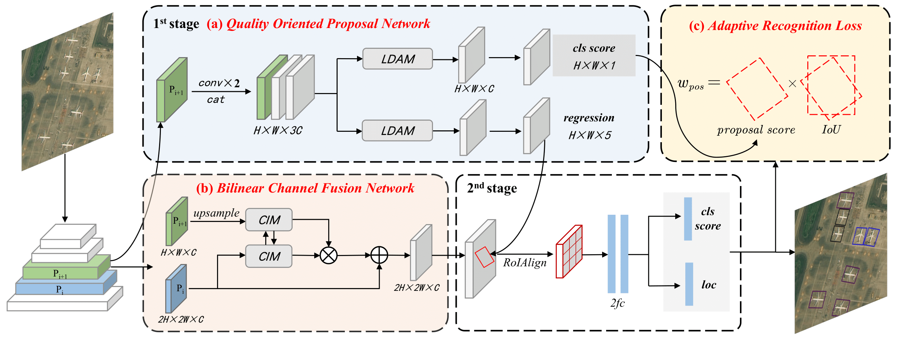

# PETDet
Official implement for the paper: PETDet: Proposal Enhancement for Two-Stage Fine-Grained Object Detection (under review).


## Introduction
 

Fine-grained object detection (FGOD) extends object detection with the capability of fine-grained recognition. In recent two-stage FGOD methods, the region proposal serves as a crucial link between detection and fine-grained recognition. However, current methods overlook that some proposal-related procedures inherited from general detection are not equally suitable for FGOD, limiting the multi-task learning from generation, representation, to utilization. In this paper, we present PETDet (Proposal Enhancement for Two-stage fine-grained object detection) to properly handle the sub-tasks in two-stage FGOD methods. Firstly, an anchor-free Quality Oriented Proposal Network (QOPN) is proposed with dynamic label assignment and attention-based decomposition to generate high-quality oriented proposals. Additionally, we present a Bilinear Channel Fusion Network (BCFN) to extract independent and discriminative features from the proposals. Furthermore, we design a novel Adaptive Recognition Loss (ARL) which offers guidance for the R-CNN head to focus on high-quality proposals. Extensive experiments validate the effectiveness of PETDet. Quantitative analysis reveals that PETDet with ResNet50 reaches state-of-the-art performance on various FGOD datasets, including FAIR1M-v1.0 (42.96 AP), FAIR1M-v2.0 (48.81 AP), MAR20 (85.91 AP) and ShipRSImageNet (74.90 AP). The proposed method also achieves superior compatibility between accuracy and inference speed. Our code and models will be released at https://github.com/canoe-Z/PETDet.

## Results and Models
### FAIR1M-v2.0
|                       Method                        |           Backbone            | Angle | lr<br>schd |  Aug  | Batch<br>Size | AP<sub>50</sub> |                                                                                                                                               Download                                                                                                                                                |
| :-------------------------------------------------: | :---------------------------: | :---: | :--------: | :---: | :-----------: | :-------------: | :---------------------------------------------------------------------------------------------------------------------------------------------------------------------------------------------------------------------------------------------------------------------------------------------------: |
|  [Faster R-CNN](https://arxiv.org/abs/1506.01497)   |  ResNet50<br>(1024,1024,200)  | le90  |     1x     |   -   |     2\*4      |      41.64      | [model](https://drive.google.com/file/d/1o2K12ouHxo2QM03Nia-dpiO25mpVopmV/view?usp=drive_link) \| [log](https://drive.google.com/file/d/1OTLsiIly_bkSF9hFiQmV04Cg_32w3J6U/view?usp=drive_link) \| [submission](https://drive.google.com/file/d/1y0Qm7e94G-Gthq28VZOLbzbn6SeoTjqr/view?usp=drive_link) |
| [RoI Transformer](https://arxiv.org/abs/1812.00155) |  ResNet50<br>(1024,1024,200)  | le90  |     1x     |   -   |     2\*4      |      44.03      | [model](https://drive.google.com/file/d/1MCs5Whn25MovOB6kAzLvMbahzIo936RZ/view?usp=drive_link) \| [log](https://drive.google.com/file/d/1reVeo4uVazShO9qtVxAddVzY7cmxAyCZ/view?usp=drive_link) \| [submission](https://drive.google.com/file/d/1NftYwDBmZsF_uf4OQe-Z5ls6TJI8aw9E/view?usp=drive_link) |
| [Oriented R-CNN](https://arxiv.org/abs/2108.05699)  |  ResNet50<br>(1024,1024,200)  | le90  |     1x     |   -   |     2\*4      |      43.90      | [model](https://drive.google.com/file/d/1-A0BBrpXW0tkCRqO7jKruBJy9gU0HQd3/view?usp=drive_link) \| [log](https://drive.google.com/file/d/1cwPaf6pgDjooZq5mE8A1uOJGVs8jaQfD/view?usp=drive_link) \| [submission](https://drive.google.com/file/d/1bygbpsd8V0zxqpi3_kKjG3i76TRe1-b8/view?usp=drive_link) |
|      [ReDet](https://arxiv.org/abs/2103.07733)      | ReResNet50<br>(1024,1024,200) | le90  |     1x     |   -   |     2\*4      |      46.03      | [model](https://drive.google.com/file/d/1sV-igM-oxYs-uc4OgTz9XLsebIAF07ph/view?usp=drive_link) \| [log](https://drive.google.com/file/d/1iR0WU5uIGDufRu1mQvFVpklXIqLIOsZg/view?usp=drive_link) \| [submission](https://drive.google.com/file/d/1KhBlj2TOUA-M_E5EVDejOXEYiOwR3OKh/view?usp=drive_link) |
|                       PETDet                        |  ResNet50<br>(1024,1024,200)  | le90  |     1x     |   -   |     2\*4      |      48.81      | [model](https://drive.google.com/file/d/1IJCddYsepBoNqhvxKR2gTOs3fju6QGdR/view?usp=drive_link) \| [log](https://drive.google.com/file/d/1ofOpc6fYpRFXUee-c73Dy8AHxZGepmUE/view?usp=drive_link) \| [submission](https://drive.google.com/file/d/13FukuL04H-cX00IUse7kGafuv0t38xOD/view?usp=drive_link) |

### MAR20
|                       Method                        |       Backbone        | Angle | lr<br>schd |  Aug  | Batch<br>Size | AP<sub>50</sub> |  mAP  |                                                                                            Download                                                                                            |
| :-------------------------------------------------: | :-------------------: | :---: | :--------: | :---: | :-----------: | :-------------: | :---: | :--------------------------------------------------------------------------------------------------------------------------------------------------------------------------------------------: |
|  [Faster R-CNN](https://arxiv.org/abs/1506.01497)   | ResNet50<br>(800,800) | le90  |     3x     |   -   |     2\*4      |      75.01      | 47.57 | [model](https://drive.google.com/file/d/1kn-rT-9jlcFi4PSGn7l2ph_BSifUMKIw/view?usp=drive_link) \| [log](https://drive.google.com/file/d/1YMuR6Dewypg4h2VpaW9sZrXqLBraismi/view?usp=drive_link) |
| [RoI Transformer](https://arxiv.org/abs/1812.00155) | ResNet50<br>(800,800) | le90  |     3x     |   -   |     2\*4      |      82.46      | 56.43 | [model](https://drive.google.com/file/d/1Ti60ymSTy9iXw5htuenKXoitOFODrWwZ/view?usp=drive_link) \| [log](https://drive.google.com/file/d/15DEmLUzxnggdYDw5jSbXd9n_ARtq4IFp/view?usp=drive_link) |
| [Oriented R-CNN](https://arxiv.org/abs/2108.05699)  | ResNet50<br>(800,800) | le90  |     3x     |   -   |     2\*4      |      82.71      | 58.14 | [model](https://drive.google.com/file/d/1vWV37HOv7xhxBjeWGrPvii7bEYjf_lkn/view?usp=drive_link) \| [log](https://drive.google.com/file/d/1TMl87WfxF8b_8XD7ZJFfjTukxFqcRjS7/view?usp=drive_link) |
|                       PETDet                        | ResNet50<br>(800,800) | le90  |     3x     |   -   |     2\*4      |      85.91      | 61.48 | [model](https://drive.google.com/file/d/18iy2WvjmCPd8I4TGvM_Aecy3VILpuUbo/view?usp=drive_link) \| [log](https://drive.google.com/file/d/1w9nmrYEWhtqXsbOVYNlDAxP3hh6Y6jYa/view?usp=drive_link) |
### ShipRSImageNet
|                       Method                        |        Backbone         | Angle | lr<br>schd |  Aug  | Batch<br>Size | AP<sub>50</sub> |  mAP  |                                                                                            Download                                                                                            |
| :-------------------------------------------------: | :---------------------: | :---: | :--------: | :---: | :-----------: | :-------------: | :---: | :--------------------------------------------------------------------------------------------------------------------------------------------------------------------------------------------: |
|  [Faster R-CNN](https://arxiv.org/abs/1506.01497)   | ResNet50<br>(1024,1024) | le90  |     3x     |   -   |     2\*4      |      54.75      | 27.60 | [model](https://drive.google.com/file/d/1WEt05QWhCI4-9MqTrfLHTx55beiuJJOC/view?usp=drive_link) \| [log](https://drive.google.com/file/d/1OviFAcOxgyWjGFVQ8VETYCVHEAmYEXiy/view?usp=drive_link) |
| [RoI Transformer](https://arxiv.org/abs/1812.00155) | ResNet50<br>(1024,1024) | le90  |     3x     |   -   |     2\*4      |      60.98      | 33.56 | [model](https://drive.google.com/file/d/1sBdYAhXkK0C7f3KvvguZoS218BAOW9cb/view?usp=drive_link) \| [log](https://drive.google.com/file/d/1lx77T3SkEjn_DkevSyJcq1sXct6YPnjz/view?usp=drive_link) |
| [Oriented R-CNN](https://arxiv.org/abs/2108.05699)  | ResNet50<br>(1024,1024) | le90  |     3x     |   -   |     2\*4      |      71.76      | 51.90 | [model](https://drive.google.com/file/d/1aiRQ93xwmf1z1OU-Xu09Fc06C4-j_GYN/view?usp=drive_link) \| [log](https://drive.google.com/file/d/1mZZyMeJXrjxQdc3bV-SFVWFu_-GLnfvE/view?usp=drive_link) |
|                       PETDet                        | ResNet50<br>(1024,1024) | le90  |     3x     |   -   |     2\*4      |      74.90      | 55.69 | [model](https://drive.google.com/file/d/1vYOVKh_XmEx-SC2nvSDc4Exiw2Xq_GFG/view?usp=drive_link) \| [log](https://drive.google.com/file/d/1nVaI8piN9aCoBF-C_iWUh0ZdSBIEaaWw/view?usp=drive_link) |
## Installation
This repo is based on [mmrotate 0.x](https://github.com/open-mmlab/mmrotate) and [OBBDetection](https://github.com/jbwang1997/OBBDetection).

**Step 1.** Create a conda environment and activate it.

```shell
conda create --name petdet python=3.10 -y
conda activate petdet
```

**Step 2.** Install PyTorch following [official instructions](https://pytorch.org/get-started/locally/), e.g.

```shell
conda install pytorch torchvision torchaudio pytorch-cuda=11.8 -c pytorch -c nvidia
```

**Step 3.** Install [MMCV 1.x](https://github.com/open-mmlab/mmcv) and [MMDetection 2.x](https://github.com/open-mmlab/mmdetection) using [MIM](https://github.com/open-mmlab/mim).

```shell
pip install -U openmim
mim install mmcv-full==1.7.1
mim install mmdet==2.28.2
```

**Step 4.** Install PETDet from source.
```shell
git clone https://github.com/canoe-Z/PETDet.git
cd mmrotate
pip install -v -e .
```
## Data Preparation
For FAIR1M, Please crop the original images into 1024×1024 patches with an overlap of 200 by run the [split tool](tools/data/fair1m/README.md).

The data structure is as follows:

```none
PETDet
├── mmrotate
├── tools
├── configs
├── data
|   ├── FAIR1M1_0
│   │   ├── train
│   │   ├── test
│   ├── FAIR1M2_0
│   │   ├── train
│   │   ├── val
│   │   ├── test
│   ├── MAR20
│   │   ├── Annotations
│   │   ├── ImageSets
│   │   ├── JPEGImages
│   ├── ShipRSImageNet
│   │   ├── COCO_Format
│   │   ├── VOC_Format
```

## Inference

Assuming you have put the splited FAIR1M dataset into `data/split_ss_fair1m2_0/` and have downloaded the models into the `weights/`, you can now evaluate the models on the FAIR1M_V2.0 test split:

```
./dist_test.sh configs/petdet/ \
  petdet_r50_fpn_1x_fair1m_le90.py \
  weights/petdet_r50_fpn_1x_fair1m_le90.pth 4 --format-only \
  --eval-options submission_dir=work_dirs/FAIR1M_2.0_results
```

Then, you can upload `work_dirs/FAIR1M_2.0_results/submission_zip/test.zip` to [ISPRS Benchmark](https://www.gaofen-challenge.com/benchmark).

## Training

The following command line will train `petdet_r50_fpn_1x_fair1m_le90` on 4 GPUs:

```
./dist_train.sh configs/petdet/petdet_r50_fpn_1x_fair1m_le90.py 4
```

**Notes:**
- The models will be saved into `work_dirs/petdet_r50_fpn_1x_fair1m_le90`.
- If you use a different mini-batch size, please change the learning rate according to the [Linear Scaling Rule](https://arxiv.org/abs/1706.02677).
- We use 4 RTX3090 GPUs for the training of these models with a mini-batch size of 8 images (2 images per GPU). However, we found that training with a smaller batchsize may yield slightly better results on the FGOD tasks.
